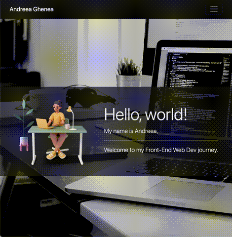

# Challenge 03 UX and Advanced CSS: Bootstrap Portfolio

## Description 

The purpose of this project was to rebuild a portfolio layout from scratch using the Bootstrap CSS Framework in order to learn how it works and become familiar with it.

## Usage 

The following animations show the [web application's](https://agh911.github.io/Bootstrap-Portfolio/) appearance and functionality:

* Desktop

* Tablet

* Mobile

## Links

* [Deployed Application](https://agh911.github.io/Bootstrap-Portfolio/).

## Credits

* [Hero image](https://unsplash.com/photos/m_HRfLhgABo).
* [Bootstrap Documentation](https://getbootstrap.com/docs/4.6/getting-started/introduction/).
* [Font Awesome Icons](https://fontawesome.com/).
* [GitHub Badges](https://shields.io/)

## License

This project is licensed under the MIT License - see the LICENSE.md file for details.

---

AG © 2022